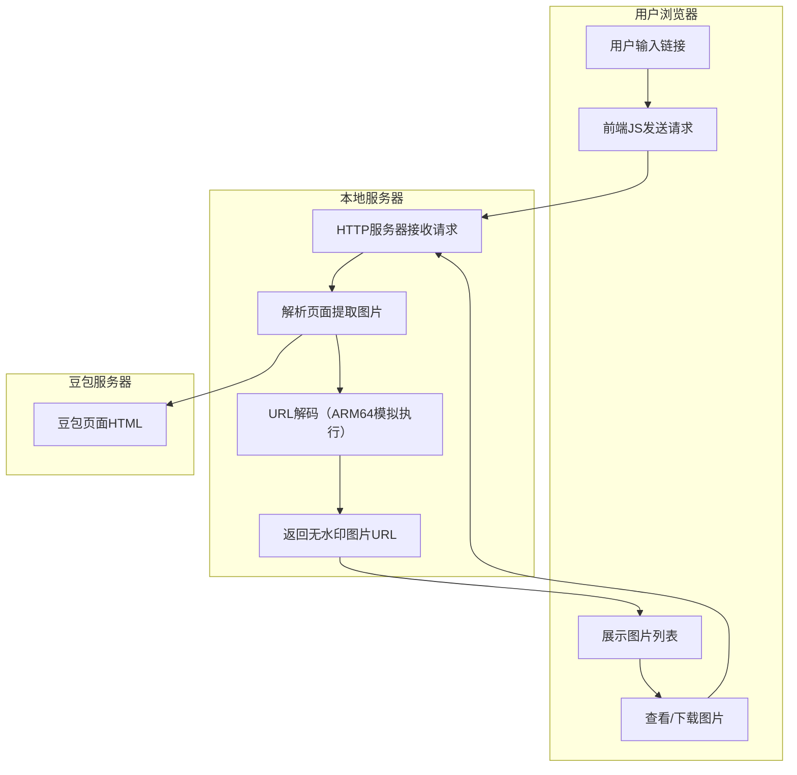
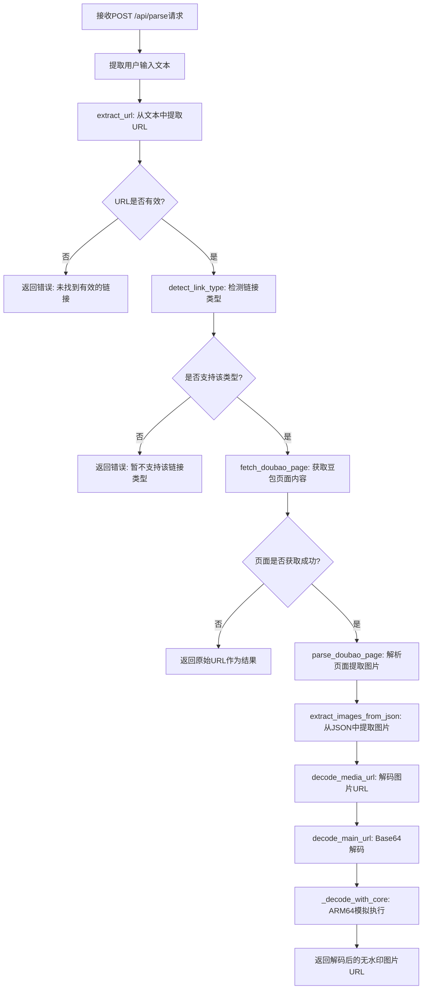
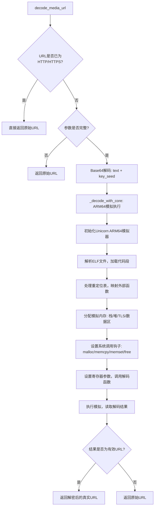
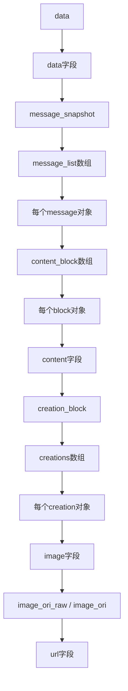

# 豆包图片去水印工具 - 精简版

## 项目简介

这是一个用于从豆包分享链接中提取无水印图片的工具。核心功能是通过解析豆包页面数据，提取加密的图片URL，并使用 ARM64 模拟执行技术解码出真实的无水印图片地址。

## 项目结构

```
internal-demo/
├── main.py                    # 主程序入口，包含HTTP服务器和解析逻辑
├── decode_worker.py           # 核心解码引擎（ARM64模拟执行）
├── app/
│   ├── static/
│   │   ├── index.html         # 前端页面
│   │   └── assets/
│   │       └── app-runtime.js # 前端逻辑
│   └── vendor/
│       └── libvideodec.so     # ARM64解码算法共享库（二进制文件）
└── README.md                  # 项目说明文档
```

## 核心流程

### 1. 整体架构图



### 2. 后端解析流程图



### 3. URL解码流程图（核心）



### 4. JSON数据结构路径



## 核心函数说明

### 后端函数

| 函数名 | 功能 | 文件位置 |
|--------|------|----------|
| `extract_url()` | 从文本中提取URL | main.py:76 |
| `detect_link_type()` | 检测链接类型 | main.py:99 |
| `fetch_doubao_page()` | 获取豆包页面HTML | main.py:133 |
| `extract_images_from_json()` | 从JSON中提取图片 | main.py:181 |
| `parse_doubao_page()` | 解析页面提取图片 | main.py:275 |
| `decode_media_url()` | 解码媒体URL（封装函数） | main.py:407 |
| `decode_main_url()` | 核心解码函数 | decode_worker.py:109 |
| `_decode_with_core()` | ARM64模拟执行解码 | decode_worker.py:147 |
| `MainHandler` | HTTP请求处理器 | main.py:441 |

### 前端函数

| 函数名 | 功能 | 文件位置 |
|--------|------|----------|
| `detectLinkType()` | 检测链接类型 | app-runtime.js:96 |
| `handleParse()` | 处理解析请求 | app-runtime.js:117 |
| `parseLink()` | 发送解析请求 | app-runtime.js:149 |
| `handleParseResult()` | 处理解析结果 | app-runtime.js:167 |
| `showImages()` | 显示图片列表 | app-runtime.js:200 |
| `viewImage()` | 在新窗口查看图片 | app-runtime.js:236 |
| `downloadImage()` | 下载图片 | app-runtime.js:246 |

## API接口

### POST /api/parse

**功能**: 解析分享链接，提取图片

**请求体**:
```json
{
    "text": "用户输入的文本"
}
```

**响应**:
```json
{
    "type": "image",
    "images": [
        {"url": "https://p11-flow-imagex-sign.byteimg.com/...无水印图片URL..."}
    ],
    "video": null,
    "videos": []
}
```

### GET /api/media?url=xxx

**功能**: 媒体代理（解决CORS问题）

**参数**:
- `url`: 媒体文件的原始URL（需URL编码）

**响应**: 返回媒体文件内容

### GET /api/download?url=xxx

**功能**: 文件下载

**参数**:
- `url`: 文件的原始URL（需URL编码）
- `filename`: 可选，下载文件名

**响应**: 返回文件内容，触发下载

## 核心解码技术说明

### 为什么需要ARM64模拟执行

豆包平台的媒体URL使用了**自定义加密算法**，该算法编译为 **ARM64 架构** 的共享库（`libvideodec.so`）。由于项目运行在 **x86_64 Windows** 平台上，无法直接执行 ARM64 代码，因此需要使用 **Unicorn Engine** 进行跨架构模拟。

### 模拟内存布局

```
内存地址范围        用途
─────────────────────────────────
0x1000-0x...      libvideodec.so代码/数据段（动态映射）
0xC00-0xC40       系统调用模拟入口点
0x70000000        栈空间（2MB）
0x71000000        堆空间（4MB）
0x72000000        TLS（线程本地存储，4KB）
0x73000000        输入/输出数据区（64KB）
0xDEAD0000        返回地址（终止点）
```

### 安全机制

| 安全机制 | 说明 |
|---------|------|
| **超时控制** | 最多执行30秒 |
| **指令限制** | 最多执行800万条ARM64指令 |
| **非法内存访问钩子** | 拒绝所有非法内存访问 |
| **内存隔离** | 使用独立的虚拟地址空间 |

## 运行方式

```bash
# 进入项目目录
cd D:\python\internal-demo

# 启动服务器（默认端口8081）
python main.py

# 指定端口启动
python main.py --port 8081
```

启动后访问: http://127.0.0.1:8081

## 技术栈

- **后端**: Python 3.13 (内置HTTP服务器)
- **核心解码**: Unicorn Engine (ARM64模拟执行)
- **前端**: HTML5 + CSS3 + JavaScript (ES6+)
- **解析**: 正则表达式 + JSON解析
- **代理**: 本地HTTP代理（解决CORS问题）

## 运行依赖

确保系统中安装了以下依赖：
- Python 3.13 或更高版本
- unicorn 库（ARM64模拟器）
- pyelftools 库（ELF文件解析）

## 注意事项

1. **libvideodec.so 文件**：这是核心解码算法的二进制文件，必须与 main.py 位于同一目录下的 `app/vendor/` 文件夹中。
2. **网络访问**：需要联网访问豆包平台获取页面内容。
3. **安全限制**：解码引擎设置了严格的安全限制，防止恶意代码执行。
